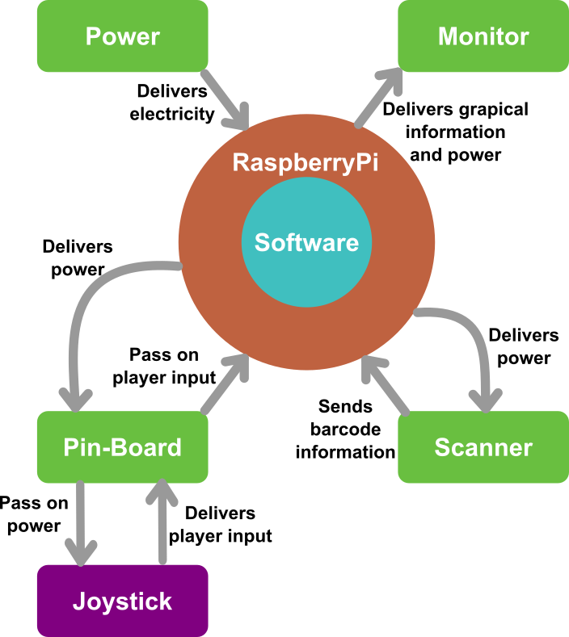

[[section-system-scope-and-context]]

= Overview

This document should help the reader understand this document.

== Business Context

[cols="1,3", options="header"]
|===
| Interface | Description

| Player
| Is the person interacting with the arcade machine and gives input through the scaner, joystick.

| Technician
| May perform maintenance, system startup, shutdown, or updates. Provides input via power controls or SD card. Receives logs or system diagnostics.

|===

== Techincal Context

[cols="1,3", options="header"]
|===
| Interface | Description

| Joystick
| Receives player input and sends it to the raspberrypi

| Raspberry Pi OS
| Is the used operating system for the raspberrypi

| Micro HDMI (via HDMI adapter)
| Used to transmit video output. A Micro-USB to HDMI adapter is used to connect the Raspberry Pi to a display monitor.

| USB-C Power
| Is the slot for powering the raspberrypi

| USB-A Barcode Scanner
| Connected via USB-A; allows players to scan barcodes which are interpreted as in-game input or user identification.

| 20-Pin Connector Pin-Board
| Is a 20 pin cable connected to a pin-board with the raspberrypi. That pin-board contains wiring to the joystick

|===

Visualization of technical interfaces:

