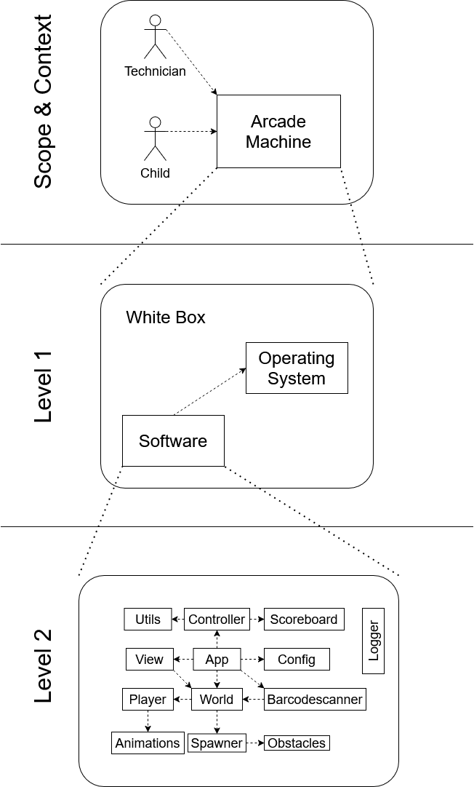

[[section-building-block-view]]

= Overview

This document will explain how the sorce code is structured on an abstract level and delve step wise into
the details.

== Scope & Context

The more detailed scope and context is specified in document 03: link:./03_system_scope_and_context.adoc[Scope and Context]

This view contains actors interacting with our product:

- Technician: Wants to maintain the arcade and fix hardware and software
- Child: Wants to play on the arcade machine
- Arcade: Is the hardware containing the software of our game

== Level 1

This view contains systems:

- Operating System: Handles hardware resources and hosts our game software
- Software: The actual software of our game

== Level 2

This view contains the individual code sections of our product:

- Utils: Handles logic such as the game phases and difficulties
- Controller: Executes the 'logic' of the game with a set tick speed. Includes things like collision
- Scoreboard: handles the score of the player
- View: Renders all sprites of the obstacles and player(s)
- App: Initiates the game
- Config: Reads settings (example: how many players) of a configuration file outside of the program
- Player: Provides the player logic and sprite and how the player is allowed to move
- World: Initiates the level building such as the obstacle spawner and player(s)
- Barcodescanner: Handles input from the barcodescanner
- Animations: Holds all the sprites for all game objects
- Spawner: Follows a factory pattern and spawns all the obstacles during the game
- Obstacles: Generalized; there are multiple different obstacles with unqiue behavior
- Logger: A special class used in all other classes to log debug and error information -> works similar like log4j
