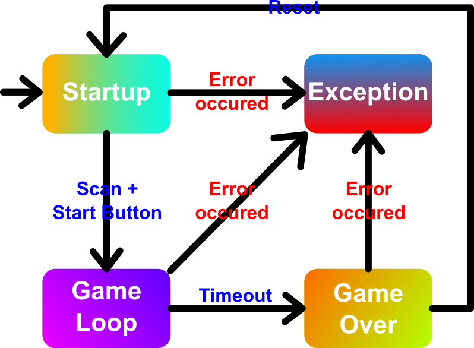

[[section-runtime-view]]
= Overview

This document describes concrete behavior and interactions of the system’s building blocks in form of 
scenarios.

The following table shows all abstract scenarios the software can encounter

[cols="1,3", options="header"]
|===
| Scenario | Description

| Startup
| This is the menu screen, allowing the player to scan and start the game. The main menu appears when the arcade is powered and turned on or if the game is restarted from a previous game over

| Game Loop
| This is the actual game in which the player can score. This scenario is triggered when the player scanned a cloth and then pressed a button at the main menu

| Game Over
| This scenario describes the game state when the player's time run out during the game loop. It displays the players score and the highscore leaderboard and gives th option to restart the game (return back to main menu)

| Exception
| Triggers when an error has occured in any of the other scenarios

|===

Graphic overview of all scenarios:

== Startup Scenario

-insert sequence diagram here-

*Explanation*:

1. a does b
2. c does d
3. etc.

== Game Loop Scenario

-insert sequence diagram here-

*Explanation*:

1. a does b
2. c does d
3. etc.

== Game Over

-insert sequence diagram here-

*Explanation*:

1. a does b
2. c does d
3. etc.

== Exception Scenario

-insert sequence diagram here-

*Explanation*:

1. a does b
2. c does d
3. etc.
