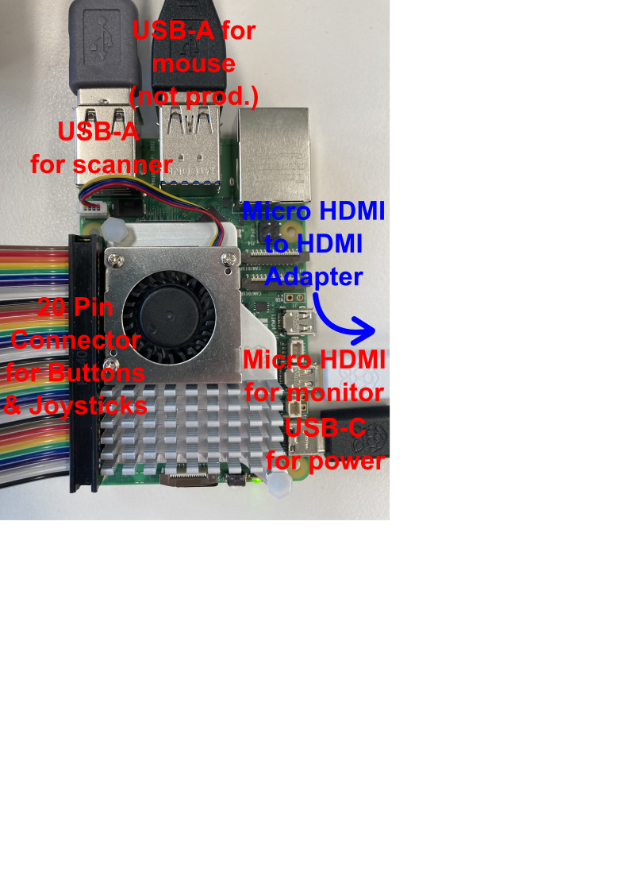
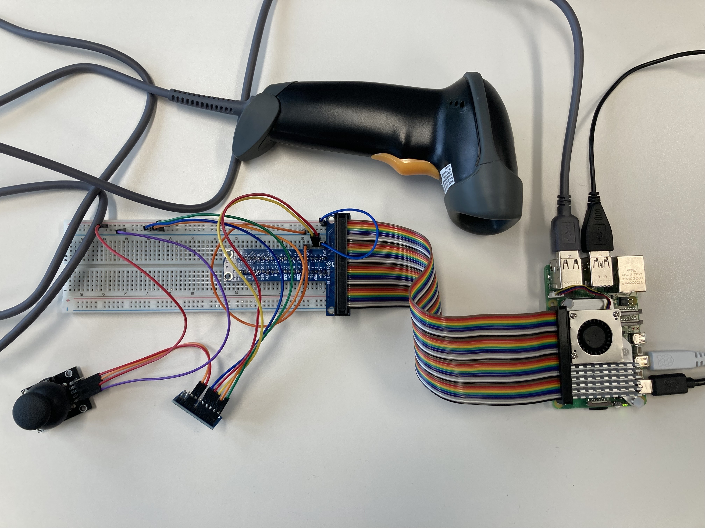

[[section-deployment-view]]
= Overview

This document aims to explain the technical infrastructure of the software

== Deployment View

The following image shows the raspberrypi and its i/o attachement and what they are used for:

The other following images shows additionally the scanner, pin-board and joystick:

== Hardware List

The following hardware components have been used:

- 1 x RaspberryPi4
- 1 x DIGITUS 1D Barcode Hand Scanner
- 1 x Pin-Board
- 1 x USB-C Cable
- 1 x USB-A Cable
- 1 x HDMI Cable
- 1 x HDMI USB Cable
- 1 x HDMI to Micro USB Adapter
- 2 x Joystick
- 2 x Buttons
- 1 x Xiaomi Monitor

